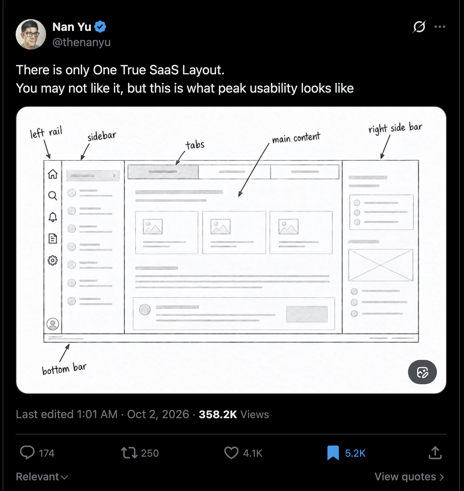

# One True Shell

A testable contract for the One True SaaS Layout: six regions, keyboard-first behavior,
tabs, and optimistic updates — for any entities, on any stack.

Layout credit: [Nan Yu](https://x.com/thenanyu/status/2105704619704029435).
The behavior contract is this project's addition.

[](https://x.com/thenanyu/status/2105704619704029435)

Each region in the drawing maps to one `data-shell` attribute the tests look for:

| In the drawing | In the spec |
|---|---|
| left rail | `data-shell="rail"` |
| sidebar | `data-shell="sidebar"` |
| tabs | `data-shell="tabs"` |
| main content | `data-shell="main"` |
| right side bar | `data-shell="aside"` |
| bottom bar | `data-shell="statusbar"` |

- `VISION.md` — what is in and out of scope (one rule per heading)
- `SPEC.md` — the contract (v0.2.0)
- `conformance/` — Playwright suite; the tests *are* the contract
- `schema/` — sample entities and seed data
- `IMPLEMENTATIONS.md` — every conformant implementation; add yours

## Build one in your stack

Implementations live in their own repos. The first one,
[one-true-shell-django](https://github.com/simkimsia/one-true-shell-django), passes 16/16 and
its CI runs this suite against itself; copy its workflow. Pick any stack, add a `run.sh`,
and run the suite against it (below). When it passes, open a PR adding it to
[IMPLEMENTATIONS.md](IMPLEMENTATIONS.md).

## Test any implementation

```bash
cd conformance && npm ci && npx playwright install chromium
IMPL_DIR=/path/to/your/impl npx playwright test
```

Your implementation needs a `run.sh` (see SPEC.md section 6).

## License

MIT for code. Spec text: MIT for now; "conformant" means passing this suite at a declared version.
